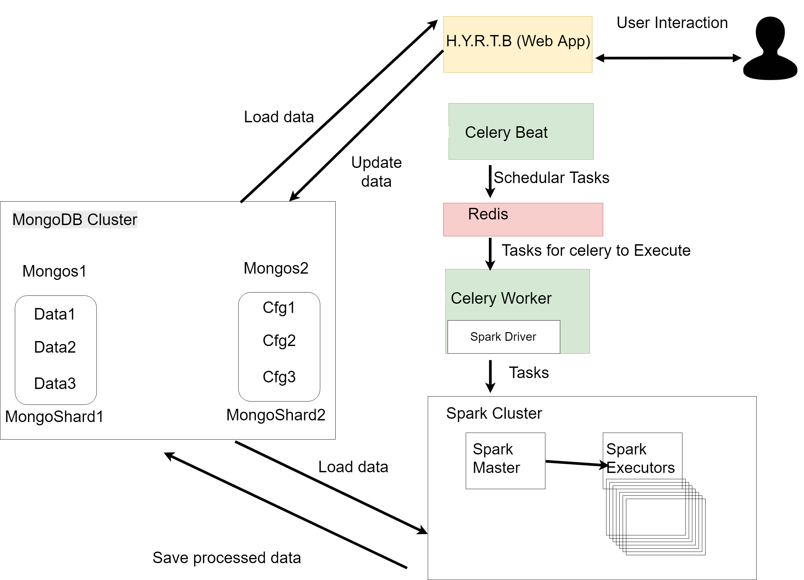
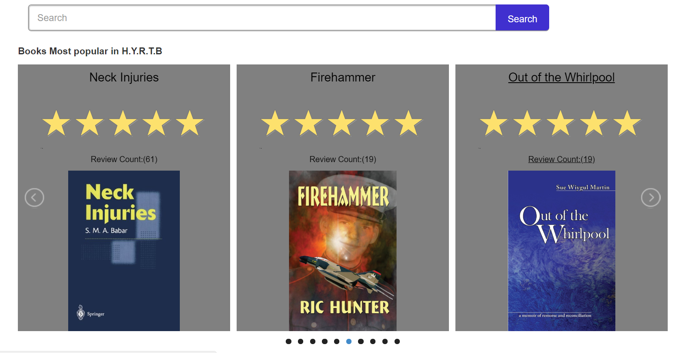
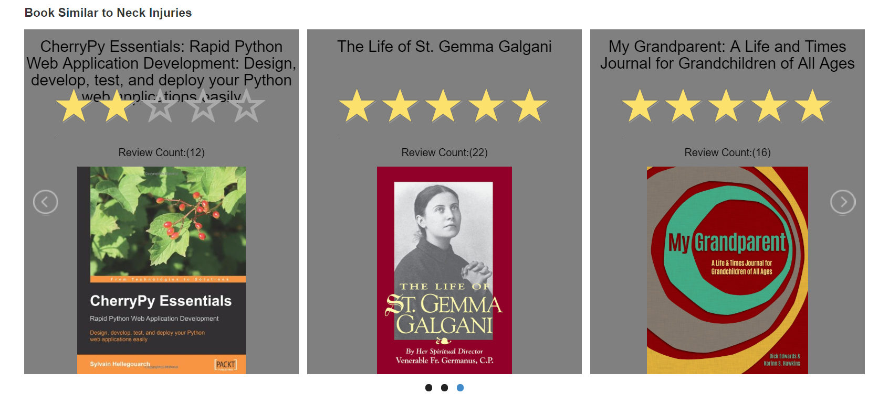
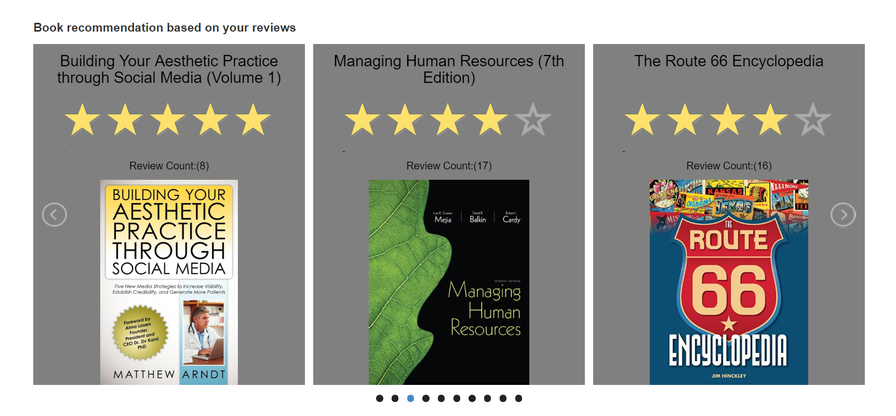

# HAVE YOU READ THIS BOOK?(H.Y.R.T.B)
 Book recommendation platform  automatically  update results based on user interaction. This project suggest a way to connect big data processing environment and commercial webapp platform

 ## Prerequisites

* You need to prepare [docker swarm environment](https://docs.docker.com/engine/swarm/) to laucn this platform.
* The sample data to be used in this projects are prepared in mongo directory. You can get original data from [here](http://jmcauley.ucsd.edu/data/amazon/).

 ## Getting Started
 * You can start this project in develop mode with
`docker-compose up ` in development mode
* To start this porject in production mode you need to prepare few more docker settings.
* First you need to create docker swarm overlay network with `docker network create --attachable -d overlay mongo
` and `docker network create --attachable -d overlay sparknetwork
`
* Second you  need to add label to each node.

**Mongo data nodes**

```bash
docker node update --label-add data1=true prod-mongodata-1
docker node update --label-add data2=true prod-mongodata-2
docker node update --label-add data3=true prod-mongodata-3
```

**Mongo config nodes**

```bash
docker node update --label-add cfg1=true prod-mongocfg-1
docker node update --label-add cfg2=true prod-mongocfg-2
docker node update --label-add cfg3=true prod-mongocfg-3
```

**Mongos nodes**

```bash
docker node update --label-add mongos1=true prod-mongos-1
docker node update --label-add mongos2=true prod-mongos-2
```

  * Finally you can deploy your fully scalable service with `docker stack deploy -c docker-compose-prod.yml up` commands.

  * If you want to login as a user in README file you can login with
  ```
  ID:test1234@gmail.com
  PASSWORD:test1234
  ```

## Platform composition
* Webapplication built by **Flask** frameworks.
 * **Standalone Spark Cluster** have been used to handle and extract useful data from databases and utilize in webapp.
* Handle async and scheduler job with **Celery Beat** and **Celery Worker**.
* Compose **MongoDB** Cluster to form a high-available and scalable db  to fully utilize big data.
 
## Platform main functions

* This platform offer 3 main ways to recommend books to you.
  * Book recieved best reviews from users.
  
  * Most close book that recieved most similar review point to last review based on cosine similarity
  
  * Recommended books with [collaborative filtering](https://spark.apache.org/docs/latest/ml-collaborative-filtering.html)
  
* All of this book recommendations are updated automatically with users interactions with this platform. 


 ## Running the tests

* This platform is built on automated test environment with python unittest. In development mode you can test your application with `docker exec -it webapp python3 tests.py`


## License

React is [MIT licensed](./LICENSE).
